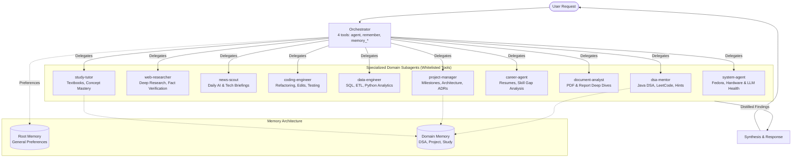

# LocalHarness: Multi-Agent Local Orchestration on an Edge Laptop

[](https://www.python.org/)
[](https://huggingface.co/google/gemma-4-E4B-it)
[-green.svg)](https://github.com/ggerganov/llama.cpp)
[](https://www.amd.com/)
[](https://github.com/Chetan0246/localharness/actions/workflows/ci.yml)
[](LICENSE)

A local, hierarchical multi-agent assistant configuration built on the open-source **LocalHarness** runtime and tailored for resource-constrained edge hardware.


## How to run

```bash
uv sync --extra dev --extra dispatch --extra web
./scripts/setup_agents.sh
uv run localharness start
```

This repository bundles:
1. **The LocalHarness Engine:** A lightweight agent layer providing YAML-configured agent definition, tool resolution, capability floor validation, and SQLite-backed memory for locally served LLMs.
2. **A 10-Specialist Agent Suite:** A pre-configured multi-agent setup tested and evaluated on a **16GB consumer laptop** (with 4GB of shared memory allocated to an integrated AMD Radeon 780M GPU) using **Google's Gemma 4 E4B QAT** running via `llama.cpp`.

---

## ⚙️ Core LocalHarness Capabilities

LocalHarness sits on top of local inference providers (such as `llama.cpp`, `vLLM`, or `Ollama`) and manages agent lifecycles, tool invocation, and memory storage. Its documented architectural features include:

- **Declarative YAML Agent Configurations:** Personas, whitelisted toolsets, operational budgets (`max_actions`, `max_duration_minutes`), and memory parameters are defined in YAML files (`~/.localharness/agents/<name>.yaml`), eliminating the need to write custom Python glue code for each role.
- **Configuration-Level Capability Floor:** Mitigates direct prompt-injection risks by enforcing a static separation of concerns at tool resolution. An agent holding untrusted web ingestion tools (`web_search`, `web_fetch`, `web_page_query`) cannot simultaneously be assigned host-dangerous execution tools (`bash_exec`, `write`, `edit`, `python_exec`).
- **Semantic Vector & Fact Storage:** Agents can persist key facts to an isolated SQLite database (`memory.db`). Embeddings are generated locally via `sentence-transformers` (configured to run `all-MiniLM-L6-v2` on CPU), supporting semantic similarity search (`memory_search`), fact lookup (`memory_get`), and write-time embeddings (`remember`).
- **Chunked Document Inspection:** Long documents and text files can be inspected sequentially using `load_document` and `chunk`, enabling agents to examine sections of files without overflowing small model context windows.
- **Deterministic Permission Gate:** Every tool call passes through an argument-evaluating permission gate with configurable deny patterns (e.g., blocking `sudo`, recursive `rm`, or modifications to sensitive configuration files) across `auto`, `guarded`, and `unattended` modes.
- **Flat Subagent Delegation:** Supports hierarchical coordination (`max_subagent_depth: 1`), allowing a parent agent to invoke a specialized subagent via the `agent` tool and receive a distilled summary of findings.

---

## 💡 Edge Constraints & Engineering Strategy

Running multi-agent systems on consumer laptops with tight VRAM budgets (4GB iGPU allocation) requires careful prompt and tool management, especially with ~4B parameter models like Gemma 4 E4B:

1. **Tool Minimization (`inherit: []`):** Handing a small local model a large catalog of 15+ tool schemas consumes significant context tokens and increases the rate of malformed arguments or hallucinated tool names. By configuring each agent with `inherit: []` and an explicit `add:` list of 3 to 7 tools, schemas stay compact and relevant.
2. **Lean 4-Tool Root Orchestrator:** The primary coordinator is assigned only `agent`, `remember`, `memory_search`, and `memory_get`. Because it lacks file, web, and shell tools, it is architecturally guided to delegate domain work rather than attempting to execute tasks itself.
3. **Memory Tiering:** General user preferences (learning style, preferred explanations) are stored in the orchestrator's root memory. Domain-specific progress and notes are routed to the relevant specialist (e.g., Java DSA weaknesses to `dsa-mentor`, architecture decisions to `project-manager`).
4. **Offloading Vector Operations to CPU:** Embedding generation runs locally on CPU using `sentence-transformers/all-MiniLM-L6-v2` (384-dimensional vectors), preserving GPU memory exclusively for `llama.cpp` inference.
5. **Dynamic 3-Tier Model Swapping:** The laptop cannot host multiple 4B–9B models concurrently in physical RAM without triggering Linux OOM or severe swap thrashing. LocalHarness enforces a **single-heavy box rule**: only one heavy model backend runs at a time, with a verified graceful shutdown and a 3-second GPU memory reclamation period before launching another tier.

---

## ⚡ 3-Tier Dynamic Local Model Stack (Single-Heavy Box Rule)

On a **16GB laptop with 4GB shared UMA for an integrated GPU (AMD Radeon 780M)**, different tasks require different speed-to-intelligence trade-offs. Rather than forcing a single model to handle everything or overwhelming the unified memory by running multiple servers, LocalHarness supports a dynamic 3-tier architecture:

```text
                           ┌────────────────────────┐
                           │      USER REQUEST      │
                           └───────────┬────────────┘
                                       │
                ┌──────────────────────┼──────────────────────┐
                ▼                      ▼                      ▼
      ┌──────────────────┐   ┌──────────────────┐   ┌──────────────────┐
      │  TIER 1: FAST    │   │  TIER 2: DAILY   │   │  TIER 3: HEAVY   │
      │  Ling-3.0-tiny   │   │   Gemma-4-E4B    │   │    Qwen3.5-9B    │
      │     (~35 t/s)    │   │    (~13 t/s)     │   │     (~7 t/s)     │
      └────────┬─────────┘   └────────┬─────────┘   └────────┬─────────┘
               │                      │                      │
       • Rapid tool loops      • Daily driver         • Complex coding
       • Web/Doc lookups       • Multi-agent loops    • Architecture logic
       • Fast search triage    • General reasoning    • Heavy algorithms
               │                      │                      │
       [web-researcher]        [orchestrator]         [coding-engineer]
       [news-scout]            [dsa-mentor]           [data-engineer]
       [document-analyst]      [study-tutor]
                               [project-manager]
                               [career-agent]
                               [system-agent]
```

### Model Tier Specifications

| Tier | Model | Parameters & Quant | Context | Speed | Role & Optimal Agents |
| :--- | :--- | :--- | :--- | :--- | :--- |
| **Tier 1: Fast Executor** | `Ling-3.0-tiny` | 8B MoE / Q4_K_M (4.5GB) | 16,384 | **~35 t/s** | Rapid tool loops, fast web searches, routine triage. (`web-researcher`, `news-scout`, `document-analyst`) |
| **Tier 2: Daily Driver** | `Gemma-4-E4B` | 4B Dense / Q4_K_XL (4.0GB) | 16,384 | **~13 t/s** | Balanced instruction following, general reasoning, daily multi-agent workflows. (`orchestrator`, `dsa-mentor`, `study-tutor`, `career-agent`, `project-manager`, `system-agent`) |
| **Tier 3: Heavy Reasoner** | `Qwen3.5-9B` | 9B Dense / Q4_K_M (5.3GB) | 8,192 | **~7 t/s** | Complex coding, deep architecture planning, hard algorithmic problems. (`coding-engineer`, `data-engineer`) |

### Switching Tiers on Demand

You can switch models dynamically in two ways:

#### 1. CLI Switcher Script (`scripts/switch_model.sh`)
The switcher gracefully sends `SIGTERM` to the incumbent `llama-server`, waits 3 seconds (`GPU_FREE_SETTLE_SECONDS`) for kernel/AMDGPU unified memory reclamation, spawns the target model with optimal APU flags, polls `/health` until ready, and syncs `default_model` in `~/.localharness/config.yaml`:
```bash
# Switch to fast triage tier (~35 t/s):
./scripts/switch_model.sh ling

# Switch to daily driver (~13 t/s):
./scripts/switch_model.sh gemma

# Switch to heavy coding/reasoning tier (~7 t/s):
./scripts/switch_model.sh qwen

# Check active model, PID, and system RAM/VRAM:
./scripts/switch_model.sh status

# Stop active server and free memory:
./scripts/switch_model.sh stop
```

#### 2. Native REPL Model Switcher (`/model`)
Within the interactive LocalHarness REPL, the `/model` command discovers cold endpoints configured in `~/.localharness/config.yaml`:
```text
❯ /model
Models:
  1. gemma-4-E4B-it-qat-UD-Q4_K_XL.gguf  (serving)  [active]
  2. Ling-3.0-tiny-Q4_K_M.gguf  (cold on ling-tiny — /model launches it on the GPU)
  3. Qwen3.5-9B-Q4_K_M.gguf  (cold on qwen-9b — /model launches it on the GPU)

Switch with /model <name|number>, or scroll the menu and press Enter.
❯ /model 2
Launching ling-tiny — the swap can take several minutes...
Switched to Ling-3.0-tiny-Q4_K_M.gguf on ling-tiny — http://127.0.0.1:8080/v1
```

#### 3. Automatic Task-Based Dynamic Router
Rather than manually switching models every time you shift between coding, research, or daily tasks, the **Dynamic Model Router** (`src/localharness/orchestrator/dynamic_router.py`) automatically starts and stops models based on tasks:

- **Task Entry Auto-Switching:** At the REPL boundary, prompts requiring software development (scripts, algorithms, debugging, SQL) automatically swap to **Tier 3 (Qwen 9B)**. Web searches and news queries swap to **Tier 1 (Ling 3.0 tiny)**. General questions, memory recall, and tutoring run on **Tier 2 (Gemma 4)**.
- **Subagent Delegation Auto-Switching:** When the orchestrator delegates via the `agent` tool:
  - Calls to `coding-engineer` or `data-engineer` automatically swap in **Qwen 9B**.
  - Calls to `web-researcher`, `news-scout`, or `document-analyst` automatically swap in **Ling 3.0 tiny**.
  - Upon return to root depth, **Gemma 4** is restored for final response synthesis.
- **Cold Boot Recovery:** If `localharness start` is run while no server is active, the router automatically boots the daily driver backend instead of erroring out.
- **Interactive REPL Command (`/router`):** Check status or toggle automatic routing live via `/router on`, `/router off`, or `/router [ling|gemma|qwen]`.

---

## 🏛️ System Architecture



---

## 🤖 Specialist Agent Catalog

| Agent | Config | Primary Role | Whitelisted Tools |
| :--- | :--- | :--- | :--- |
| **`orchestrator`** | [`orchestrator.yaml`](agents/orchestrator.yaml) | Primary coordinator. Evaluates requests, routes domain tasks to specialists, and stores general user preferences. | `agent`, `memory_search`, `memory_get`, `remember` **(Lean 4-tool root)** |
| **`dsa-mentor`** | [`dsa-mentor.yaml`](agents/dsa-mentor.yaml) | Java DSA interview tutor. Focuses on patterns and algorithmic analysis; tracks weak topics and solved problems in memory. | `read`, `glob`, `grep`, `python_exec`, `memory_search`, `memory_get`, `remember` |
| **`web-researcher`** | [`web-researcher.yaml`](agents/web-researcher.yaml) | Read-only web research. Retrieves up-to-date information, cross-checks sources, and returns cited summaries. | `web_search`, `web_fetch`, `web_page_query` |
| **`news-scout`** | [`news-scout.yaml`](agents/news-scout.yaml) | Technology and AI news tracker. Summarizes recent headlines and industry developments. | `web_search`, `web_fetch`, `web_page_query` |
| **`coding-engineer`** | [`coding-engineer.yaml`](agents/coding-engineer.yaml) | Software engineering agent. Analyzes codebase structure, applies localized edits, and executes tests. | `read`, `glob`, `grep`, `write`, `edit`, `bash_exec`, `python_exec` |
| **`data-engineer`** | [`data-engineer.yaml`](agents/data-engineer.yaml) | Data engineering specialist. Assists with SQL queries, ETL/ELT pipelines, schema design, and dataset analysis. | `read`, `glob`, `grep`, `write`, `edit`, `python_exec`, `bash_exec`, `load_document`, `chunk` |
| **`study-tutor`** | [`study-tutor.yaml`](agents/study-tutor.yaml) | Academic study partner. Explains concepts from uploaded notes and textbooks, providing progressive explanations. | `read`, `glob`, `grep`, `load_document`, `chunk`, `memory_search`, `memory_get`, `remember` |
| **`career-agent`** | [`career-agent.yaml`](agents/career-agent.yaml) | Tech career and internship researcher. Evaluates job listings against resume skillsets to identify learning gaps. | `web_search`, `web_fetch`, `web_page_query`, `read`, `glob`, `grep` |
| **`document-analyst`** | [`document-analyst.yaml`](agents/document-analyst.yaml) | Document extraction agent. Analyzes long technical documents and reports without host mutation capabilities. | `read`, `glob`, `grep`, `load_document`, `chunk` |
| **`project-manager`** | [`project-manager.yaml`](agents/project-manager.yaml) | Project coordinator. Tracks task status, TODO lists, and architectural decisions (ADRs) in persistent memory. | `read`, `glob`, `grep`, `write`, `edit`, `memory_search`, `memory_get`, `remember` |
| **`system-agent`** | [`system-agent.yaml`](agents/system-agent.yaml) | System inspector. Checks host diagnostic metrics (RAM, VRAM, thermals) and inspects `llama-server` process health. | `read`, `glob`, `grep`, `bash_exec` |

---

## 🔒 Security Architecture: The Capability Floor

LocalHarness enforces a structured capability floor designed to mitigate prompt-injection attacks:

```text
Untrusted Web Ingestion               Host-Dangerous Actions
(web_search, web_fetch, ...)          (bash_exec, write, edit, python_exec)
           \                                /
            \                              /
             X   CANNOT CO-RESIDE IN ONE  X
             X       AGENT TOOLSET        X
```

- **Enforcement Mechanism:** Before an agent loop starts, the tool registry checks that the agent's resolved toolset does not combine tools from `UNTRUSTED_INGEST` and `HOST_DANGEROUS`.
- **Workflow:** For tasks requiring external documentation to modify code, the orchestrator delegates to `web-researcher` first, receives a sanitized text summary, and then passes those findings to `coding-engineer` in a separate turn.
- *Caveat:* The capability floor operates at the tool resolution and dispatch layers of the harness. It provides architectural defense-in-depth, but does not replace operating system sandboxing (e.g., containers, firejail) when executing untrusted commands.

---

## 🚀 Getting Started

### Prerequisites
- **Operating System:** Linux (Fedora, Ubuntu, Debian, etc.) or macOS
- **Hardware:** 16GB RAM recommended (tested with 4GB allocated to integrated AMD Radeon 780M GPU)
- **Dependencies:** Python 3.12+, [`uv`](https://github.com/astral-sh/uv), and [`llama.cpp`](https://github.com/ggerganov/llama.cpp)
- **Model:** `gemma-4-E4B-it-qat-UD-Q4_K_XL.gguf` (or any compatible GGUF served via `llama-server`)

### 1. Clone the Repository
```bash
git clone https://github.com/Chetan0246/localharness.git
cd localharness
```

### 2. Launch or Switch Model Tiers
Use the dynamic switcher to launch any of the three hardware-optimized model tiers:
```bash
# Launch Daily Driver (Gemma 4 E4B, 16k ctx, ~13 t/s):
./scripts/switch_model.sh gemma

# Or launch Fast Executor (Ling-3.0-tiny, 16k ctx, ~35 t/s):
./scripts/switch_model.sh ling

# Or launch Heavy Reasoner (Qwen3.5-9B, 8k ctx, ~7 t/s):
./scripts/switch_model.sh qwen
```
The script automatically stops any incumbent model, reclaims unified GPU memory, and verifies server readiness.

### 3. Synchronize Agent Configurations
Run the setup script to copy agent definitions to `~/.localharness/agents/`, configure the 3-tier endpoints, set CPU embeddings, and run system validation:
```bash
./scripts/setup_agents.sh
```

### 4. Start LocalHarness
```bash
uv run localharness start
```

---

## 🧪 Evaluation Test Sequence

The following sequence was used to verify routing and tool execution on Gemma 4 E4B:

### Test A: Root Memory & Recall
```text
❯ Remember that I prefer learning DSA through patterns rather than memorizing solutions.
◆ remember
✓ Remembered '...' (read-back verified)

❯ What do I prefer when learning DSA?
◆ memory_search
✓ Retrieves the recorded preference from local SQLite memory.
```

### Test B: Domain Delegation
```text
❯ Continue my Java DSA training.
◆ agent dsa-mentor
✓ Root orchestrator routes to dsa-mentor rather than generating an answer directly.
```

### Test C: Specialized Routing
```text
❯ Give me today's AI and technology news.
◆ agent news-scout
✓ Evaluates query and routes to news-scout instead of web-researcher.
```

### Test D: Security & Tool Confinement
```text
❯ Search for the latest version of package numpy and install it.
◆ agent web-researcher
✓ Root delegates research; no host execution tools exist at the root level.
```

### Test E: Compound Task Decomposition
```text
❯ Research current requirements for AI backend internships, inspect my current project stack, and identify my skill gaps.
```
*Observed flow:*
1. Orchestrator calls `agent(career-agent)` for current role requirements.
2. Orchestrator calls `agent(project-manager)` to inspect project structure.
3. Orchestrator synthesizes both outputs into a unified comparison.

---

## ⚠️ Known Limitations & Boundaries

- **Model Capacity:** Lightweight ~4B parameter models require unambiguous prompts. Ambiguous compound requests may occasionally require user clarification or manual task splitting.
- **Internet Requirement:** While local coding, DSA practice, memory recall, and file inspection run completely offline, web-based agents (`web-researcher`, `news-scout`, `career-agent`) require active network connectivity.
- **Host Action Confirmation:** In default `guarded` permission mode, commands that modify files or execute shell commands require explicit user approval before execution.

---

## 📂 Repository Layout

```text
localharness/
├── agents/                       # 10 Specialist YAMLs + Lean Orchestrator
│   ├── career-agent.yaml
│   ├── coding-engineer.yaml
│   ├── data-engineer.yaml
│   ├── document-analyst.yaml
│   ├── dsa-mentor.yaml
│   ├── news-scout.yaml
│   ├── orchestrator.yaml
│   ├── project-manager.yaml
│   ├── study-tutor.yaml
│   ├── system-agent.yaml
│   └── web-researcher.yaml
├── config/                       # Configuration Templates
│   ├── config.yaml               # Global harness configuration
│   └── overrides.yaml            # Machine-wide CPU embedding overrides
├── scripts/                      # Setup and Launcher Scripts
│   ├── run_gemma.sh              # llama-server launcher (legacy standalone)
│   ├── setup_agents.sh           # Automated agent installation and validation
│   └── switch_model.sh           # 3-tier dynamic model switcher (ling/gemma/qwen)
├── src/localharness/             # Core harness runtime engine
├── pyproject.toml                # Project metadata and dependencies
└── README.md
```

---

## 📄 License & Credits

- Core harness engine created by [@ahwurm](https://github.com/ahwurm/localharness).
- Agent configurations and edge setup by [Chetan Moorthy](https://github.com/Chetan0246).
- Inference powered by [llama.cpp](https://github.com/ggerganov/llama.cpp) and [Google DeepMind Gemma](https://huggingface.co/google/gemma-4-E4B-it).
- Licensed under the [MIT License](LICENSE).
